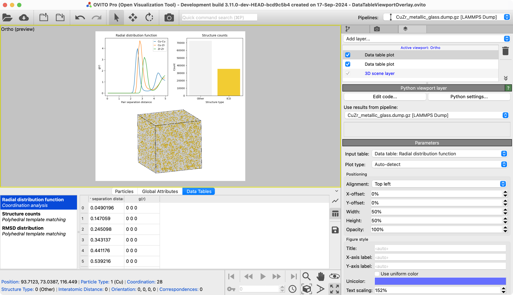

# Data Table Plot Overlay
The Data Table Plot Overlay is a Python-based viewport overlay for OVITO that leverages the matplotlib library to plot data tables from your pipeline and overlays the plots onto the rendered images. It provides a convenient way to include plots generated from existing data tables in your image or animation rendered with OVITO Pro.

## Description
This modifier can automatically choose the most suitable plot style for visualizing the data, such as scatter plots, line plots, histograms, or bar charts. However, you can also manually select a specific plot type from the provided drop-down list.

### Features
- Choose from various plot types, including line plots, histograms, bar charts, and scatter plots.
- Customize the position, size, opacity, and anchor point of the overlay.
- Configure plot style settings such as title, axis labels, text scaling, and color.
- Control the y-axis range and enable minor ticks for more detailed visualization.
- Automatically detect the appropriate plot type or manually select one from the drop-down list.

## Parameters
- **Data Table Identifier**: Select the data table to be plotted.
- **Plot Type**: Choose the type of plot (Auto-detect, Line, Distribution histogram, Category bar chart, Scatter).
- **Alignment**: Select the corner of the viewport where the plot is displayed (anchor position).
- **X-Position**: Set an offset to the x-position of the overlay relative to the anchor point.
- **Y-Position**:  Set an offset to the y-position of the overlay relative to the anchor point.
- **Width**: Adjust the width of the overlay.
- **Height**: Adjust the height of the overlay.
- **Opacity**: Control the opacity of the overlay.
- **Title**: Specify the title for the plot.
- **X-Axis Label**: Set the label for the x-axis.
- **Y-Axis Label**: Set the label for the y-axis.
- **Use Uniform Color**: Toggle to use a uniform color for the plot.
- **Unicolor**: Choose the color when using uniform color.
- **Text Scaling**: Adjust the text size in the plot.
- **Fix Y-Range**: Toggle to manually fix the y-axis range.
- **Y-Range**: Set the y-axis range (if Fix y-range is enabled).
- **Minor Y-Ticks**: Enable minor ticks on the y-axis.
- **Minor X-Ticks**: Enable minor ticks on the x-axis.

## Example


## Installation
- OVITO Pro [integrated Python interpreter](https://docs.ovito.org/python/introduction/installation.html#ovito-pro-integrated-interpreter):
  ```
  ovitos -m pip install --user git+https://github.com/ovito-org/DataTablePlotOverlay.git
  ``` 
  The `--user` option is recommended and [installs the package in the user's site directory](https://pip.pypa.io/en/stable/user_guide/#user-installs).

- Other Python interpreters or Conda environments:
  ```
  pip install git+https://github.com/ovito-org/DataTablePlotOverlay.git
  ```

## Technical information / dependencies
- Tested on OVITO version 3.9.3-dev

## Contact
Constanze Kalcher support@ovito.org
